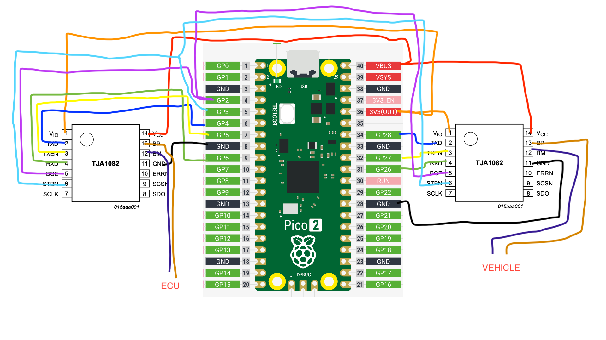

[](https://deepwiki.com/dynm/pico-flexray)

### pico-flexray — Low Cost FlexRay MITM Module

A Raspberry Pi Pico-based FlexRay man-in-the-middle (MITM) bridge that forwards frames between ECU and vehicle transceivers, with optional test replay output and a Panda-compatible USB interface.

- Core features:
  - Continuous, bidirectional FlexRay frame forwarding (vehicle ↔ ECU)
  - Optional replay/test output via a dedicated GPIO
  - USB interface is Panda-compatible
  - FlexRay MITM WIP

### Hardware connections
1. For read-only FlexRay frame capture, connect a single transceiver to the vehicle’s bus, attach its BP/BM lines to the FlexRay lines in your vehicle.
2. To differentiate frames from the ECU and the vehicle, use a man-in-the-middle (MITM) setup: split the original FlexRay cable and connect each half to its own transceiver with separate BP/BM pairs—one transceiver for the ECU side, one for the vehicle side.

Refer to your board’s pinout for physical pad/header locations. Signals below use Pico GPIO numbers as configured in `src/main.c`.

| GPIO | Signal | Direction | Side | Notes |
|---:|---|---|---|---|
| 2 | `BGE` | Output | Both | BGE to FlexRay transceivers (set High to enable)
| 3 | `STBN` | Output | Both | STBN to transceivers (set High to exit standby)
| 4 | `TXD_TO_ECU` | Output | ECU | TXD to ECU-side transceiver
| 5 | `TXEN_TO_ECU` | Output | ECU | TX_EN for ECU-side transceiver
| 6 | `RXD_FROM_ECU` | Input | ECU | RXD from ECU-side transceiver
| 28 | `TXD_TO_VEHICLE` | Output | Vehicle | TXD to vehicle-side transceiver
| 27 | `TXEN_TO_VEHICLE` | Output | Vehicle | TX_EN for vehicle-side transceiver
| 26 | `RXD_FROM_VEHICLE` | Input | Vehicle | RXD from vehicle-side transceiver
| 15 | `REPLAY_TX` | Output | Test | PIO replay/test sample FlexRay frame output




### Build and flash

```bash
git clone https://github.com/dynm/pico-flexray/
cd pico-flexray
```

Option 1: Visual Studio Code
1. Install the [Raspberry Pi Pico extension](https://marketplace.visualstudio.com/items?itemName=raspberry-pi.raspberry-pi-pico)
2. Open this repo, click the Pico extension tab on the left panel
3. Click "Switch Board" and select your Pico board
4. Hold BOOT, plug USB, then you can release BOOT
5. Click "Run Project (USB)"
6. Done!

Option 2: Command line
Prerequisites:
- Raspberry Pi Pico SDK 2.1.x (env var `PICO_SDK_PATH` or the VS Code Pico extension auto-setup)
- `picotool` for flashing, or UF2 drag-and-drop

Configure and build (default board is set in `CMakeLists.txt` to `pico2`):

```bash
cd pico-flexray
mkdir build && cd build
ninja -C build
```

Artifacts are produced in `build/` (e.g., `pico_flexray.uf2`, `pico_flexray.elf`).

Flash to device:
- UF2: Hold BOOT, plug USB, then copy `build/pico_flexray.uf2` to the RPI-RP2 mass storage device.
- Picotool: put the board in BOOTSEL or use reset-to-boot, then:

```bash
picotool load -f build/pico_flexray.uf2
```

Run-time:
- USB enumerates as a vendor-specific device (no CDC serial). Use UART for logs.
- On boot, the app prints pin assignments and status, enables transceivers, and starts forwarding.

### Adjusting pins or board

If you use a different board or wiring, update the GPIO defines at the top of `src/main.c` and/or modify set(PICO_BOARD pico2 CACHE STRING "Board type") in CMakeLists.txt. Rebuild and reflash.

### Streaming with Cabana

To visualize FlexRay data using Cabana:

1. Clone the OpenPilot repository and switch to the FlexRay-enabled branch:
   ```bash
   git clone https://github.com/dynm/openpilot
   cd openpilot
   git checkout cabana-flexray
   ```

2. Set up the environment:
   ```bash
   ./tools/op.sh setup
   ```

3. Build Cabana:
   ```bash
   source .venv/bi
   scons -j$(nproc) tools/cabana/cabana
   ```

4. Launch Cabana:
   ```bash
   ./tools/cabana/cabana
   ```